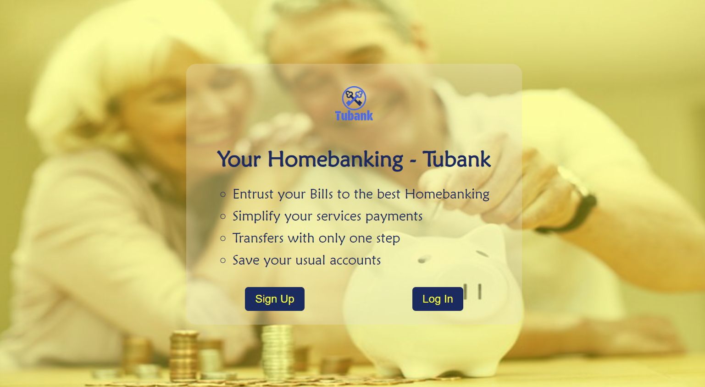

;
🥶Desafío de invierno by Nucba!☃️ - Tubank: Plataforma de Homebanking

Se trata de un desafío de Diseño Web y Javascript resuelto de forma individual.🧑‍💻

¿Cuál es el objetivo de este desafío?
👉Realizar una solución a la problemática presentada, con los conocimientos aprendidos hasta la fecha.

👉Herramientas: 
    - Visual Studio Code: 1.70.00;
    - HTML 5;
    - CSS3;
    - Javascript Puro;
    - Git y GitHub;
    - Google Fonts;
    - Canva;
    - Free Logo Design https://www.freelogodesign.org/;
    - Coolers pallet generator - https://coolors.co/;

#HappyTech 💻
